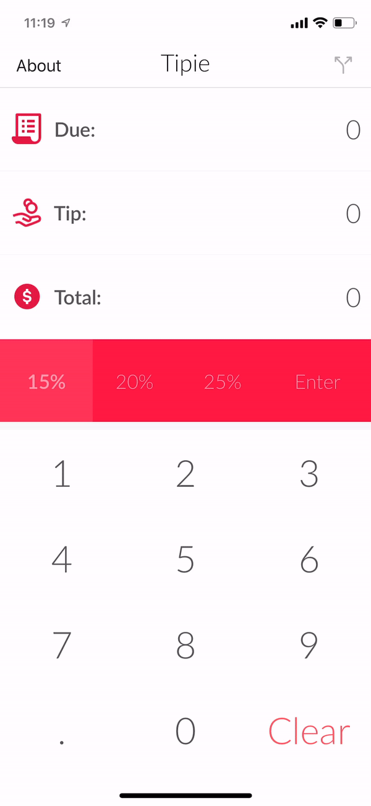

# Pre-work - *Tipie*

 Tipie is a tip calculator application for iOS.

Submitted by: **Neftali Samarey**

## User Stories

The following **required** functionality is complete:

* [✅] User can enter a bill amount, choose a tip percentage, and see the tip and total values.

The following **optional** features are implemented:

* [✅ ] Settings page to change the default tip percentage.
* [✅ ] UI animations
* [✅] Making sure the keyboard is always visible and the bill amount is always the first responder. This way the user doesn't have to tap anywhere to use this app. Just launch the app and start typing.

The following **additional** features are implemented:

- [ ✅] Able to round up overall tip (toggled in the settings menu)
- [ ✅] Clean modern design.
- [ ✅] Split bill among friends/group of people.

## App Walkthrough 

Here's a walkthrough of implemented app running on iPhone

## App Store Availability

Yup, its there, go ahead and download now. Its free! 😉

## Notes

Only 2 challenges encountered on this project were the custom keyboard, as well as coming up with a clean design that is both modern and simple. 

## License

    Copyright 2019 Neftali Samarey

    Licensed under the Apache License, Version 2.0 (the "License");
    you may not use this file except in compliance with the License.
    You may obtain a copy of the License at

        http://www.apache.org/licenses/LICENSE-2.0

    Unless required by applicable law or agreed to in writing, software
    distributed under the License is distributed on an "AS IS" BASIS,
    WITHOUT WARRANTIES OR CONDITIONS OF ANY KIND, either express or implied.
    See the License for the specific language governing permissions and
    limitations under the License.
